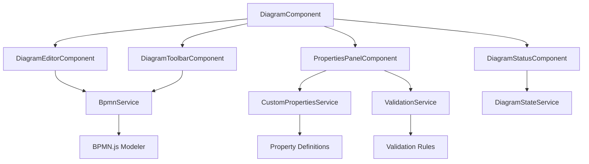

# System Architecture

## 🏗️ Overview

The BPMN Angular Integration project follows a layered, modular architecture designed for maintainability, testability, and extensibility. The architecture separates concerns into distinct layers while maintaining loose coupling between components.

## 📐 Architectural Layers

```
┌─────────────────────────────────────────┐
│             Presentation Layer          │
│  ┌─────────────┐ ┌─────────────────────┐ │
│  │ Components  │ │    Templates &      │ │
│  │             │ │      Styles         │ │
│  └─────────────┘ └─────────────────────┘ │
└─────────────────────────────────────────┘
┌─────────────────────────────────────────┐
│              Service Layer              │
│  ┌─────────────┐ ┌─────────────────────┐ │
│  │   Core      │ │   Custom Properties │ │
│  │  Services   │ │    & Validation     │ │
│  └─────────────┘ └─────────────────────┘ │
└─────────────────────────────────────────┘
┌─────────────────────────────────────────┐
│              Model Layer                │
│  ┌─────────────┐ ┌─────────────────────┐ │
│  │ TypeScript  │ │     BPMN.js         │ │
│  │ Interfaces  │ │   Integration       │ │
│  └─────────────┘ └─────────────────────┘ │
└─────────────────────────────────────────┘
```

## 🧩 Component Architecture

### Core Components

#### DiagramComponent
The main container component that orchestrates the entire BPMN editing experience.

**Responsibilities:**
- Initialize BPMN.js modeler
- Coordinate child components
- Handle high-level application state
- Manage component lifecycle

**Key Features:**
- ViewChild references for modeler containers
- Element selection management
- Diagram import/export coordination

#### DiagramEditorComponent
The core BPMN diagram editing interface.

**Responsibilities:**
- Host the BPMN.js modeler instance
- Handle diagram interactions
- Manage canvas operations (zoom, pan, selection)
- Process element creation and modification

**Integration Points:**
- BPMN.js Modeler integration
- Custom properties provider registration
- Element selection events

#### PropertiesPanelComponent
Advanced properties management for BPMN elements.

**Responsibilities:**
- Display element-specific properties
- Handle property value changes
- Validate property inputs
- Apply business rules

**Features:**
- Dynamic property groups
- Custom input types (text, dropdown, checkbox, date)
- Real-time validation
- Property search and filtering

#### DiagramToolbarComponent
Main toolbar with diagram operations.

**Responsibilities:**
- File operations (new, open, save, export)
- Edit operations (undo, redo, copy, paste)
- View operations (zoom, fit, alignment)
- Validation triggers

#### DiagramStatusComponent
Status information and validation results.

**Responsibilities:**
- Display diagram validation status
- Show element count and statistics
- Error and warning notifications
- Progress indicators

### Component Communication



## 🔧 Service Layer

### BpmnService
Core service for BPMN.js integration and operations.

**Key Methods:**
```typescript
class BpmnService {
  // Modeler lifecycle
  createModeler(config: BpmnConfig): void
  destroyModeler(): void
  
  // Diagram operations
  importXML(xml: string): Promise<ImportResult>
  exportXML(): Promise<{ xml: string }>
  exportSVG(): Promise<{ svg: string }>
  
  // Element operations
  getElement(id: string): any
  getAllElements(): any[]
  
  // Command stack
  undo(): void
  redo(): void
  canUndo(): boolean
  canRedo(): boolean
}
```

### CustomPropertiesService
Manages custom properties for BPMN elements with validation and business rules.

**Key Features:**
- Property definition management
- Dynamic property schemas
- Business rule execution
- Property validation

**Core Methods:**
```typescript
class CustomPropertiesService {
  // Property management
  getElementProperties(elementId: string): EnhancedElementProperties
  setProperty(elementId: string, propertyId: string, value: any): void
  
  // Schema operations
  getPropertySchema(elementType: string): ElementPropertySchema
  registerPropertyDefinition(definition: PropertyDefinition): void
  
  // Business rules
  applyBusinessRules(elementId: string): void
  executeRule(rule: BusinessRule, context: any): void
}
```

### ValidationService
Comprehensive validation for BPMN diagrams and properties.

**Validation Types:**
- **Structural Validation** - BPMN model integrity
- **Business Rules** - Domain-specific validations
- **Property Validation** - Custom property constraints
- **Process Validation** - Workflow correctness

### DiagramStateService
Manages application state and provides reactive updates.

**State Management:**
- Current selection tracking
- Diagram modification state
- Validation results
- User preferences

### FileService
Handles file operations for diagram import/export.

**Supported Formats:**
- BPMN XML files
- SVG export
- JSON configuration

## 🔗 Data Flow

### Property Update Flow
```
User Input → Component → Service → Validation → BPMN Model → UI Update
```

### Element Selection Flow
```
Canvas Click → BPMN.js Event → Service Update → Component State → Properties Panel
```

### Validation Flow
```
Model Change → Validation Service → Rules Engine → Results → Status Display
```

## 🎨 BPMN.js Integration

### Modeler Configuration
```typescript
const modelerConfig = {
  container: diagramContainer,
  propertiesPanel: {
    parent: propertiesContainer
  },
  additionalModules: [
    BpmnPropertiesPanelModule,
    BpmnPropertiesProviderModule,
    customPropertiesProvider
  ],
  moddleExtensions: {
    custom: customExtensions
  }
};
```

### Custom Properties Provider
Extends BPMN.js with domain-specific properties:

```typescript
function CustomPropertiesProvider(propertiesPanel, translate) {
  this.getGroups = function(element) {
    return function(groups) {
      if (is(element, 'bpmn:StartEvent')) {
        groups.push(createCustomGroup(element, translate));
      }
      return groups;
    }
  };
}
```

## 🔧 Extension Points

### Adding Custom Properties
1. Define property schema in `element-schemas.ts`
2. Create property input component
3. Register with CustomPropertiesService
4. Add validation rules if needed

### Custom Validation Rules
1. Implement ValidationRule interface
2. Register with ValidationService
3. Define business logic
4. Handle error messages

### New Component Integration
1. Create Angular component
2. Inject required services
3. Implement lifecycle hooks
4. Add to module declarations

## 🚀 Performance Optimizations

### Change Detection Strategy
- OnPush change detection for performance
- Immutable state updates
- Reactive data flows with RxJS

### Memory Management
- Proper subscription cleanup
- Component destruction handling
- BPMN.js instance disposal

### Bundle Optimization
- Lazy loading for non-critical features
- Tree shaking for unused code
- Optimized imports

## 🏗️ Design Patterns

### Service Pattern
- Centralized business logic
- Dependency injection
- Single responsibility principle

### Observer Pattern
- Event-driven communication
- RxJS observables
- Reactive state management

### Strategy Pattern
- Pluggable validation rules
- Configurable property providers
- Flexible export formats

### Factory Pattern
- Property input creation
- Validation rule instantiation
- Component factory services

## 📱 Responsive Design

### Layout Strategy
- CSS Grid for main layout
- Flexbox for component arrangement
- Bootstrap 5 for responsive utilities

### Mobile Considerations
- Touch-friendly interactions
- Responsive property panels
- Adaptive toolbar layout

## 🔒 Error Handling

### Error Boundaries
- Component-level error handling
- Service-level error recovery
- User-friendly error messages

### Validation Pipeline
- Input validation
- Business rule validation
- Model consistency checks

## 🧪 Testing Strategy

### Unit Testing
- Service logic testing
- Component behavior testing
- Validation rule testing

### Integration Testing
- Component interaction testing
- Service integration testing
- BPMN.js integration testing

---

This architecture provides a solid foundation for building complex BPMN applications while maintaining code quality, performance, and extensibility.
